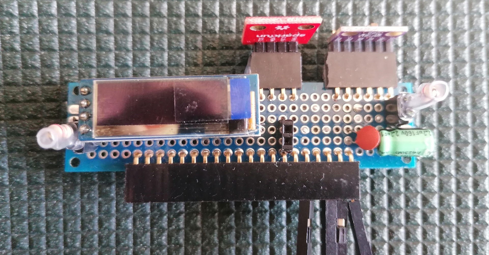
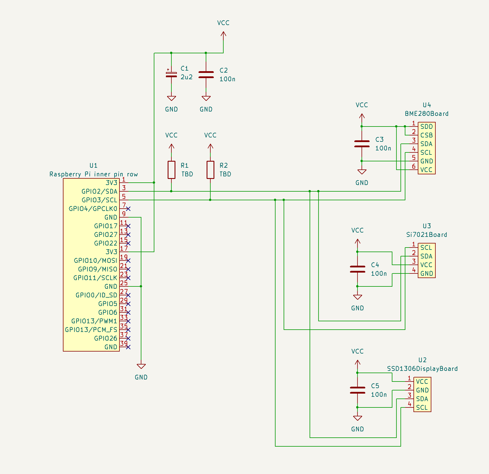

# Pi Weather Shield

## Purpose

The PiWeatherShield is designed to create a simple home weather station using a breadboard and low-cost sensors connected to a Raspberry Pi. This weather station measures the temperature, humidity, and air pressure in the room where the Raspberry Pi is located, making it perfect for indoor monitoring, which is sufficient in many use cases.

The shield is easy to solder an can be integrated with the [Home Environment Monitor](https://github.com/RobertGawron/HomeEnvironmentMonitor), adding real-time environmental data to the broader monitoring system.

## Hardware

This project is straightforward and includes the following I2C components:

* **BME280:** Temperature, Humidity, and Pressure sensor.
* **Si7021:** Temperature and Humidity sensor.
* **SSD1306:** 0.91-inch 128x32 OLED display.

Tools: KiCad.

[More info.](./Hardware/README.md)

## Installation

The application is quite simple (just a couple of Python scripts) and could easily be developed directly on the Raspberry Pi, which is probably what most people would do for a small project like this. However, I’ve chosen a different approach -one that might seem like overkill- but it allows me to learn and apply DevOps.

We'll set up a local Docker environment capable of cross-compiling Docker images that contain our application, which will then be deployed to the Raspberry Pi.

Using Ansible, we will preconfigure the Raspberry Pi (install Docker, enable I2C, etc.) and deploy the Docker images to the Pi automatically.

[More info.](./DevOps/README.md)
