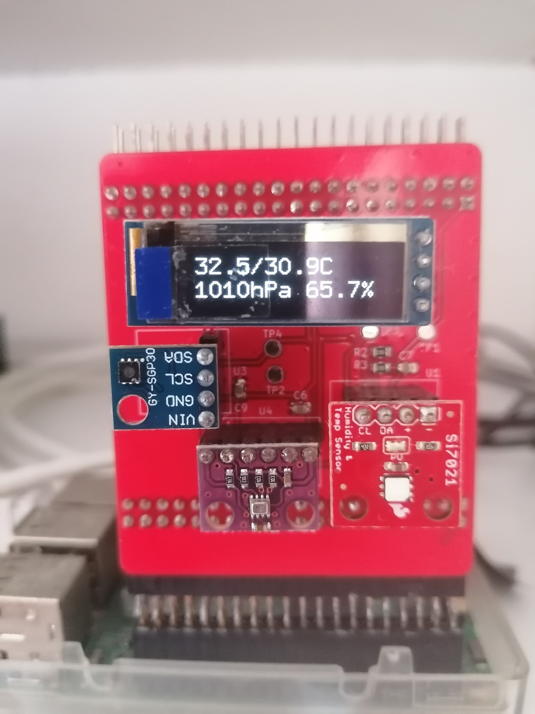
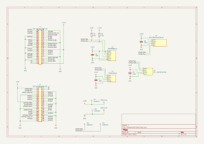

# Pi Weather Shield

## Purpose

Low-cost, easy-to-build hat Raspberry Pi that turns it into an indoor weather station. On the hardware side, it's a simple PCB with sensors I2C parts (BME280 and Si7021) and a small OLED screen to show the meassurements: temperature, humidity, and air pressure. On the software side there is a Rust app that handles the data and can send them via MQTT for furthr processing (using tools like Graphana and Home asistant).

The project can be integrated with the [Home Environment Monitor](https://github.com/RobertGawron/HomeEnvironmentMonitor), adding real-time graphs of the meassurements accessible from phone or PC.

## Hardware

This project is straightforward and includes the following I2C components:

* **Si7021:**
    * Temperature
    * Relative humidity
* **SGP30:**
    * TVOC (Total Volatile Organic Compounds)
    * eCO2 (equivalent CO2)
    * Raw hydrogen (H2) signal
    * Raw ethanol signal
* **BME280:**
    * Temperature
    * Relative humidity
    * Atmospheric pressure
* **SSD1306:** 0.91-inch 128x32 OLED display.

Tools: KiCad.

[More info.](./Hardware/README.md)

## Installation

The application is quite simple (just a couple of Python scripts) and could easily be developed directly on the Raspberry Pi, which is probably what most people would do for a small project like this. However, I’ve chosen a different approach -one that might seem like overkill- but it allows me to learn and apply DevOps.

We'll set up a local Docker environment capable of cross-compiling Docker images that contain our application, which will then be deployed to the Raspberry Pi.

Using Ansible, we will preconfigure the Raspberry Pi (install Docker, enable I2C, etc.) and deploy the Docker images to the Pi automatically.

[More info.](./DevOps/README.md)
